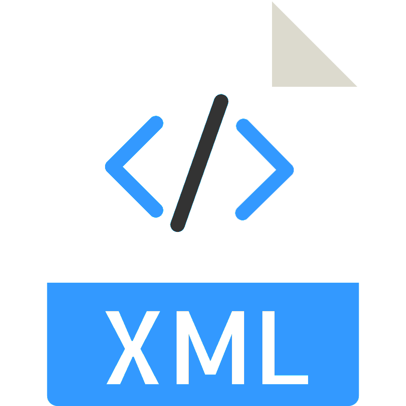

  

<h3 align="center">XML injections: their workings and countermeasures</h3>

---

 
      A project summarizing the workings of XML injections, their consequences and possible solutions for them.

## 📝 Table of Contents

- [📝 Table of Contents](#-table-of-contents)
- [🧐 About ](#-about-)
- [👁️ View Project ](#️-view-project-)
- [⛏️ Built Using ](#️-built-using-)
- [✍️ Authors ](#️-authors-)

## 🧐 About 

This is a <b>project for the 'Network Security' course at the University of Milan</b> and <b> is in Italian Language</b>.

This project is a dedicated exploration of XML Injection attacks, encompassing a comprehensive analysis of XML and its vulnerabilities, including tag injection and XML bombs, providing insights into the risks and consequences associated with these attacks, all while emphasizing responsible and ethical hacking practices.

To illustrate the concepts discussed, we provide practical examples within an ethical framework based on php servers created ad hoc. These demonstrations are intended solely for educational purposes and should never be used maliciously.

I invite you to explore our demonstration scenarios, analyze code samples, and gain insights into securing XML-based applications.

## 👁️ View Project 

- [Project's PDF](/XML-injection-project.pdf) - Project's PDF in repository

## ⛏️ Built Using 

- [Overleaf](https://www.overleaf.com/) - LaTeX Editor
- [PHP](https://www.php.net/) Servers Scripting Language

## ✍️ Authors 

- [@Salvatore Rendo](https://github.com/Salvatore-Rendo)

